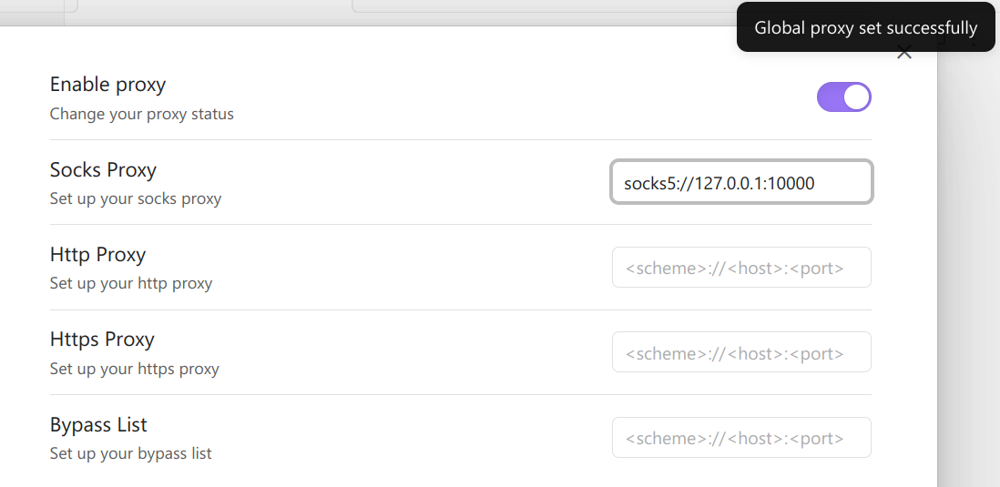

# Obsidian Global Proxy

Obsidian Global Proxy is an Obsidian plugin that makes it easy to configure web proxies and use proxies throughout Obsidian. Currently supported proxy types include socks, http, and https. It may be needed by users in areas with restricted networks.

### How to Use

Fill in the input box with the corresponding proxy address. If all the proxies are invalid, all links will be direct without using a proxy. If both socks and http/https proxies are set, they may be used.

